# Chemistry Adventure Game - Backend Documentation

This document provides a comprehensive overview of the backend system architecture for the Chemistry Adventure Game Server. Its primary purpose is to help developers and stakeholders understand the structural design, the separation of concerns, and the relationships between various components of the API.

## System Architecture

The backend is designed using a **Layered Architecture** pattern, closely following MVC (Model-View-Controller) principles, but specialized for serving a RESTful API (JSON responses) rather than rendering views.

The system is separated into the following key layers:

1.  **Core Layer (`App\Core`)**:
    *   Acts as the foundation of the framework.
    *   Includes the `Router` for defining API endpoints and mapping them to controllers.
    *   Provides `Request` and `Response` abstractions for handling incoming HTTP requests and formatting JSON outputs.
    *   Manages the `Database` connection using a Singleton pattern to ensure a single, efficient PDO instance.

2.  **Controller Layer (`App\Controllers`)**:
    *   Serves as the entry point for incoming HTTP requests.
    *   Responsible for parsing request data (body, query parameters), validating mandatory fields at a high level, and delegating the complex business logic to the Service Layer.
    *   Formats the final output using the `Response` class.

3.  **Service Layer (`App\Services`)**:
    *   Contains the core **business logic** of the application.
    *   Performs validations (e.g., checking if an email exists), orchestrates multiple repository calls (e.g., updating progress when a level result is saved), and manages transactional integrity.
    *   Keeps controllers lightweight and repositories focused solely on data access.

4.  **Repository Layer (`App\Repositories`)**:
    *   Responsible for all direct database interactions using PDO and raw SQL queries.
    *   Encapsulates the data access logic, making it easier to maintain and modify database queries without affecting business logic.

---

## Class Diagram

The following Mermaid diagram illustrates the classes, their attributes, methods, and the dependencies/relationships between them across different layers.

```mermaid
classDiagram
    namespace App_Core {
        class Database {
            -PDO $instance
            +getInstance() PDO
        }
        class Request {
            #array $body
            +getMethod() string
            +getPath() string
            +getBody() array
            +setBody(array data)
            +getHeaders() array
        }
        class Response {
            +json(mixed data, int status)
            +error(string message, int status)
            +success(mixed data, string message)
        }
        class Router {
            #array $routes
            #array $middleware
            #string $lastMethod
            #string $lastPath
            +get(string path, callable callback) Router
            +post(string path, callable callback) Router
            +middleware(mixed middleware) Router
            +dispatch(Request request)
        }
    }

    namespace App_Controllers {
        class AuthController {
            #AuthService $authService
            +__construct()
            +register(Request request) Response
            +login(Request request) Response
            +logout(Request request) Response
        }
        class LeaderboardController {
            #LeaderboardService $leaderboardService
            +__construct()
            +global(Request request) Response
            +level(Request request) Response
        }
        class LevelResultController {
            #LevelResultService $levelResultService
            +__construct()
            +index(Request request) Response
            +mapStars(Request request) Response
            +mapResults(Request request) Response
            +save(Request request) Response
        }
        class ProgressController {
            #ProgressService $progressService
            +__construct()
            +index(Request request) Response
            +update(Request request) Response
        }
        class UserController {
            #ProgressService $progressService
            +__construct()
            +getUser(Request request) Response
            +index(Request request) Response
        }
    }

    namespace App_Services {
        class AuthService {
            #UserRepository $userRepository
            +__construct()
            +register(array data) int
            +login(string email, string password) array
            +logout(int userId) bool
        }
        class LeaderboardService {
            #LeaderboardRepository $leaderboardRepository
            +__construct()
            +getGlobalLeaderboard(int limit) array
            +getLevelLeaderboard(int mapId, int levelId, int limit) array
        }
        class LevelResultService {
            #LevelResultRepository $levelResultRepository
            #ProgressService $progressService
            +__construct()
            +getResults(int userId) array
            +getMapTotalStars(int userId, int mapId) int
            +getAllMapTotalStars(int userId) array
            +getMapResults(int userId, int mapId) array
            +saveResult(array data) bool
        }
        class ProgressService {
            #ProgressRepository $progressRepository
            #LevelResultRepository $levelResultRepository
            +__construct()
            +getProgress(int userId) array
            +updateProgress(int userId, array newData) bool
        }
    }

    namespace App_Repositories {
        class UserRepository {
            #PDO $db
            +__construct()
            +findByEmail(string email) array
            +findByUsername(string username) array
            +findByToken(string token) array
            +create(array data) int
            +updateToken(int userId, string token) bool
            +createInitialProgress(int userId) bool
        }
        class LeaderboardRepository {
            #PDO $db
            +__construct()
            +getGlobalTop(int limit) array
            +getLevelTop(int mapId, int levelId, int limit) array
        }
        class LevelResultRepository {
            #PDO $db
            +__construct()
            +findByUser(int userId) array
            +getTotalsByUser(int userId) array
            +getTotalStarsByMap(int userId, int mapId) int
            +getAllMapTotalStars(int userId) array
            +findByUserAndMap(int userId, int mapId) array
            +findByUserLevel(int userId, int mapId, int levelId) array
            +save(array data) bool
        }
        class ProgressRepository {
            #PDO $db
            +__construct()
            +findByUserId(int userId) array
            +update(int userId, array data) bool
        }
    }

    %% UML Relationships
    Router ..> Request : uses
    Router ..> Response : uses
    Router --> AuthController : dispatches to
    Router --> LeaderboardController : dispatches to
    Router --> LevelResultController : dispatches to
    Router --> ProgressController : dispatches to
    Router --> UserController : dispatches to
    
    AuthController *-- AuthService : composes
    LeaderboardController *-- LeaderboardService : composes
    LevelResultController *-- LevelResultService : composes
    ProgressController *-- ProgressService : composes
    UserController *-- ProgressService : composes

    AuthService *-- UserRepository : composes
    LeaderboardService *-- LeaderboardRepository : composes
    LevelResultService *-- LevelResultRepository : composes
    LevelResultService *-- ProgressService : composes
    ProgressService *-- ProgressRepository : composes
    ProgressService *-- LevelResultRepository : composes

    UserRepository --> Database : uses
    LeaderboardRepository --> Database : uses
    LevelResultRepository --> Database : uses
    ProgressRepository --> Database : uses
```

## Component Functionality Detail

### 1. App\Core
*   **`Router`**: Core routing engine. Allows registering `GET` and `POST` paths with middleware attachment. The `dispatch()` method executes the appropriate controller and action based on the request URL.
*   **`Request`**: Abstraction over PHP's native superglobals (`$_SERVER`, `$_GET`, `$_POST`, `php://input`). Extracts the method, URL path, headers, and parsed JSON body.
*   **`Response`**: Static helper class to standardized JSON outputs with `success()` and `error()` methods, automatically managing HTTP status codes.
*   **`Database`**: Implements the Singleton pattern to guarantee only one PDO connection exists during the request lifecycle. It fetches credentials from environment variables (`$_ENV`).

### 2. App\Controllers
*   **`AuthController`**: Manages registration, login (returns tokens), and logout actions.
*   **`LeaderboardController`**: Handles requests to fetch the top players either globally or filtered by a specific map and level.
*   **`LevelResultController`**: Handles endpoints regarding fetching past results for a level/map, calculating accumulated stars, and saving new gameplay results.
*   **`ProgressController`**: Serves the user's overall game progress state (highest unlocked map/level).
*   **`UserController`**: Retrieves the authenticated user's combined profile, including base credentials and current progress totals.

### 3. App\Services (Business Logic)
*   **`AuthService`**: Validates registration credentials, hashes passwords via `PASSWORD_BCRYPT`, verifies logins, handles token generation/revocation, and initiates a blank progress record for new users.
*   **`LeaderboardService`**: A simple pass-through service currently, requesting leaderboard data from its repository.
*   **`LevelResultService`**: Highly integral service. When saving a result, it determines if the score/stars represent a new personal best. If a level is successfully completed, it automatically communicates with the `ProgressService` to unlock subsequent maps or levels.
*   **`ProgressService`**: Handles linear progression logic. It ensures that an update to progression only pushes the highest unlocked level/map forward and never backward. It also aggregates the user's total score and total stars.

### 4. App\Repositories (Data Access)
*   **`UserRepository`**: Executes queries against the `users` and `player_progress` tables regarding authentication, token updates, and user lookup.
*   **`LeaderboardRepository`**: Contains complex `JOIN` and aggregation queries to calculate ranks dynamically based on total scores and stars across all level results.
*   **`LevelResultRepository`**: Performs CRUD operations for the `level_results` table, including aggregations to calculate total collected stars per map.
*   **`ProgressRepository`**: Manages reading and updating the single row per user within the `player_progress` table.
